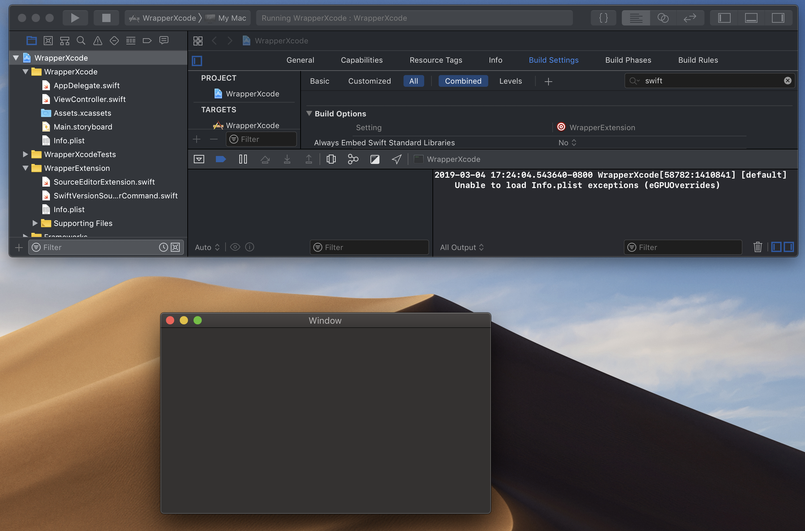
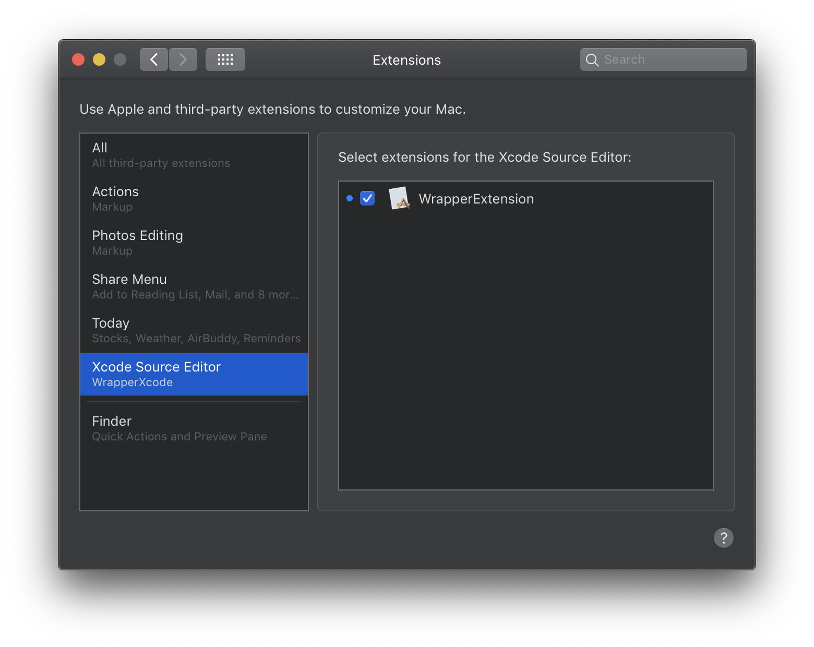
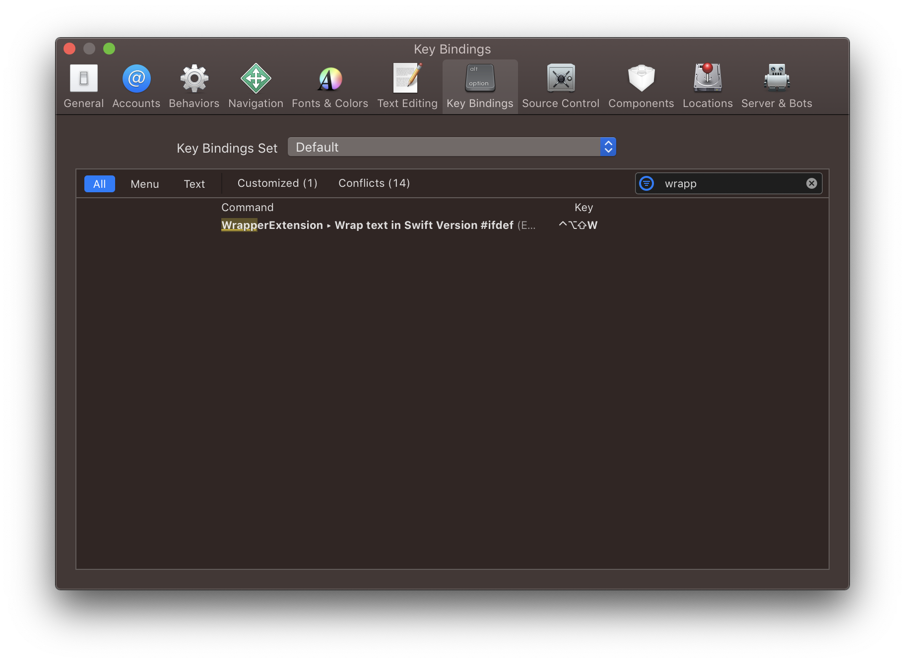

# source-editor-extension
A source editor extension for easy Swift version #if defs

## How to install

1. Clone the repository, or Download the zip
2. Open `WrapperXcode.xcodeproj`
3. Select the `WrapperXcode` application, and `Build and Run`
4. The blank application will open, and you can then quit it:

5. Head to `System Preferences` -> `Extensions`, and you should see the `WrapperExtension` ready for you to select:

6. Select the text you want to update and then run the extension via the `Editor` menu

7. Optionally set a keyboard shortcut for the extension via Xcode's `Key Bindings` pane in `Preferences`:

